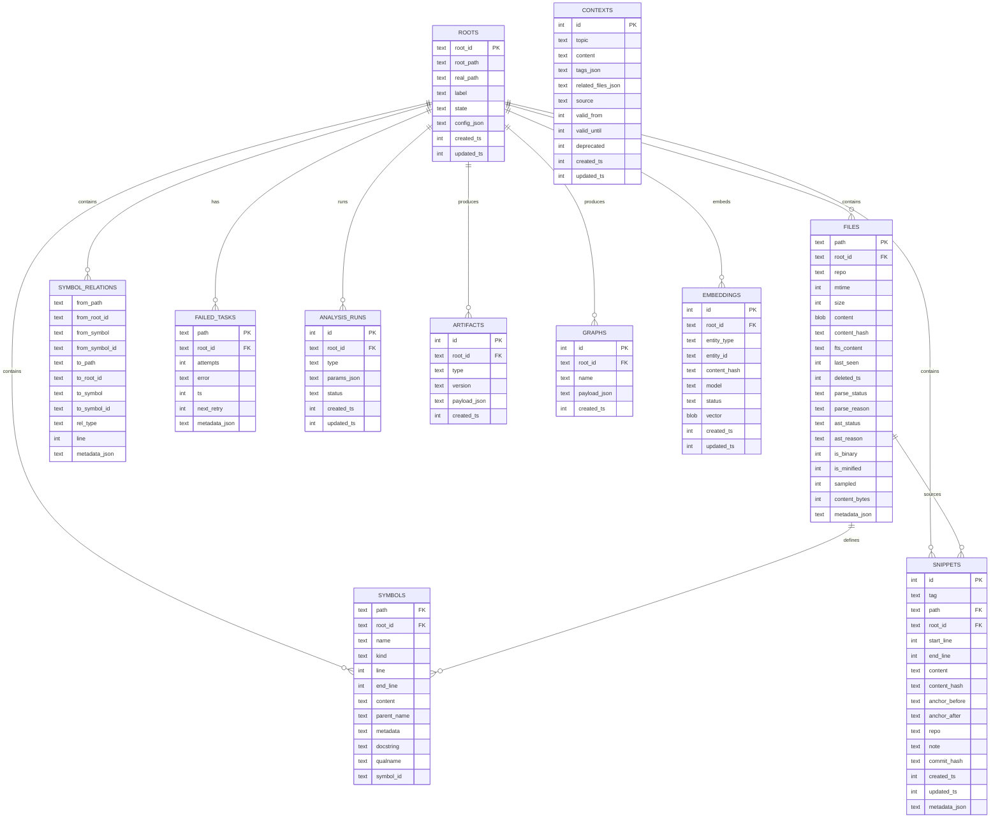

# ERD (Logical)

```mermaid
erDiagram
    ROOTS ||--o{ FILES : contains
    ROOTS ||--o{ SYMBOLS : contains
    ROOTS ||--o{ SYMBOL_RELATIONS : contains
    ROOTS ||--o{ SNIPPETS : contains
    ROOTS ||--o{ FAILED_TASKS : has
    ROOTS ||--o{ ANALYSIS_RUNS : runs
    ROOTS ||--o{ ARTIFACTS : produces
    ROOTS ||--o{ GRAPHS : produces
    ROOTS ||--o{ EMBEDDINGS : embeds

    FILES ||--o{ SYMBOLS : defines
    FILES ||--o{ SNIPPETS : sources

    ROOTS {
        text root_id PK
        text root_path
        text real_path
        text label
        text state
        text config_json
        int created_ts
        int updated_ts
    }

    FILES {
        text path PK
        text root_id FK
        text repo
        int mtime
        int size
        blob content
        text content_hash
        text fts_content
        int last_seen
        int deleted_ts
        text parse_status
        text parse_reason
        text ast_status
        text ast_reason
        int is_binary
        int is_minified
        int sampled
        int content_bytes
        text metadata_json
    }

    SYMBOLS {
        text path FK
        text root_id FK
        text name
        text kind
        int line
        int end_line
        text content
        text parent_name
        text metadata
        text docstring
        text qualname
        text symbol_id
    }

    SYMBOL_RELATIONS {
        text from_path
        text from_root_id
        text from_symbol
        text from_symbol_id
        text to_path
        text to_root_id
        text to_symbol
        text to_symbol_id
        text rel_type
        int line
        text metadata_json
    }

    SNIPPETS {
        int id PK
        text tag
        text path FK
        text root_id FK
        int start_line
        int end_line
        text content
        text content_hash
        text anchor_before
        text anchor_after
        text repo
        text note
        text commit_hash
        int created_ts
        int updated_ts
        text metadata_json
    }

    CONTEXTS {
        int id PK
        text topic
        text content
        text tags_json
        text related_files_json
        text source
        int valid_from
        int valid_until
        int deprecated
        int created_ts
        int updated_ts
    }

    FAILED_TASKS {
        text path PK
        text root_id FK
        int attempts
        text error
        int ts
        int next_retry
        text metadata_json
    }

    ANALYSIS_RUNS {
        int id PK
        text root_id FK
        text type
        text params_json
        text status
        int created_ts
        int updated_ts
    }

    ARTIFACTS {
        int id PK
        text root_id FK
        text type
        text version
        text payload_json
        int created_ts
    }

    GRAPHS {
        int id PK
        text root_id FK
        text name
        text payload_json
        int created_ts
    }

    EMBEDDINGS {
        int id PK
        text root_id FK
        text entity_type
        text entity_id
        text content_hash
        text model
        text status
        blob vector
        int created_ts
        int updated_ts
    }
```
